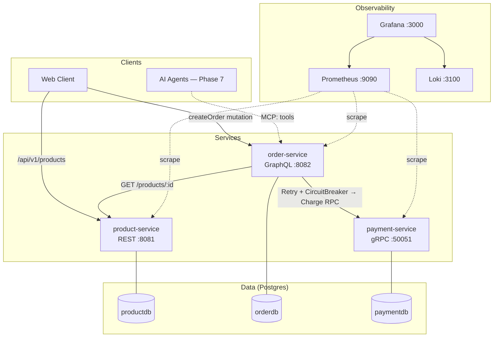
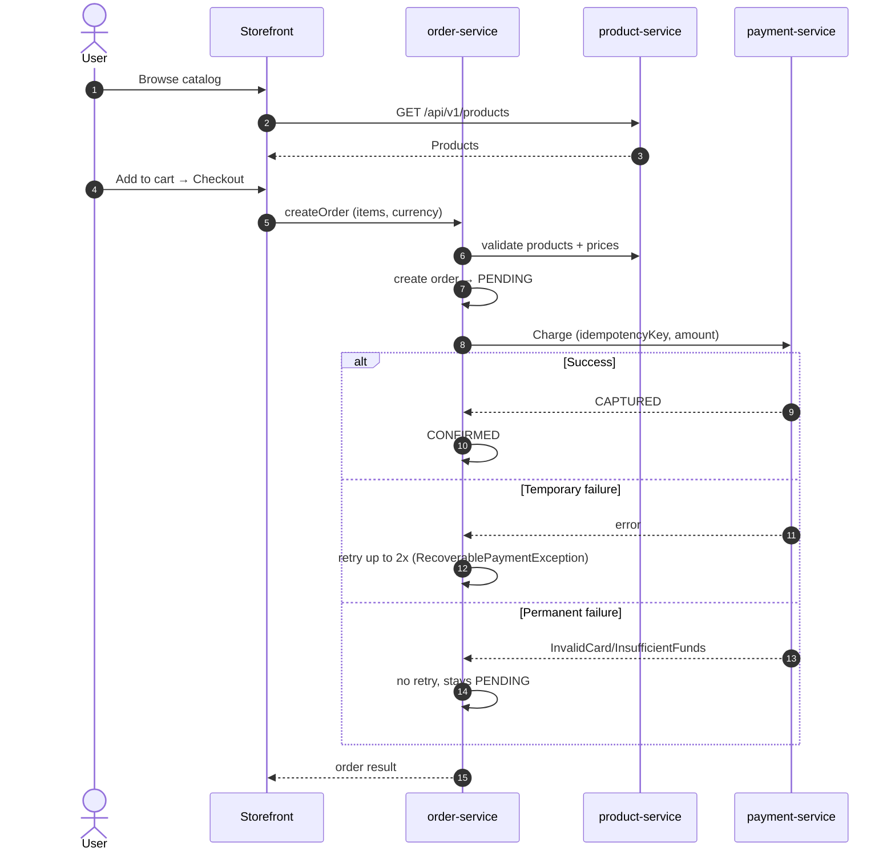

# Commerce Platform

A production-style commerce platform for learning backend protocols — **REST, GraphQL, gRPC, Kafka, MCP** — by evolving real microservices with **observability from day one**.

> **Core idea:** the business domain (Product → Order → Payment) stays constant.
> The protocol (REST, GraphQL, gRPC) is the variable. See [`docs/architect.md`](./docs/architect.md).

---

## Quick Start

**Prerequisites:** Docker (OrbStack/Docker Desktop), Java 21, Maven, Go 1.2x, Node 20+.

```bash
./scripts/run-demo.sh docker   # build + start everything
```

When done:

| URL | What you'll see |
|---|---|
| http://localhost:5173 | ApnaKart storefront — browse → cart → checkout → **CONFIRMED** |
| http://localhost:5173/admin | Dashboard, Products CRUD, Orders, Payments |
| http://localhost:3000 | **Grafana** (admin/admin) — Logs + Metrics dashboards |
| http://localhost:9090 | **Prometheus** — raw metrics |
| http://localhost:8081/swagger-ui.html | Product REST API docs |
| http://localhost:8082/graphiql | Order GraphQL explorer |
| http://localhost:8090/docs | Payment REST gateway docs |

---

## Architecture



**Protocol per service:**

| Service | Language | Protocol | Endpoints |
|---|---|---|---|
| `product-service` | Java 21 + Spring Boot | REST | `GET /api/v1/products`, CRUD |
| `order-service` | Java 21 + Spring GraphQL | GraphQL | `createOrder`, `orders`, `cancelOrder` |
| `payment-service` | Go + grpc-gateway | gRPC + REST | `Charge`, `Refund`, `List` |

---

## Checkout Flow (lifecycle)



---

## Observability (Loki + Prometheus + Grafana)

### Logs (Loki)

Structured JSON logs (logstash format) flow via the Loki Docker logging driver.
MDC fields (`correlationId`, `orderId`, `evt`) become parsed JSON fields.

| In Grafana | How |
|---|---|
| Open **Commerce — Logs** dashboard | Filter by service, view raw JSON |
| Journey trace | Use `Correlation ID` dropdown (auto-populated) |
| Search for errors | Add `| json | level="ERROR"` after the query |

### Metrics (Prometheus)

Prometheus scrapes all three services. Two Grafana dashboards are provisioned:

| Dashboard | What it shows |
|---|---|
| **Commerce — Logs** | Service logs with JSON parse, correlation ID filter |
| **Commerce — Metrics (RED + business)** | RPS, errors, latency p95/p99, JVM/Go runtime, orders, revenue, circuit breaker state |

---

## Repository Layout

```
├── product-service/          REST (Java 21 + Spring Boot)
├── order-service/            GraphQL (Java 21 + Spring GraphQL)
├── payment-service/          gRPC (Go)
├── web/                      Storefront + Admin (React + Vite)
├── docs/                     Learning path (start with architect.md)
├── docker/                   Compose + Grafana dashboards + Prometheus config
├── scripts/                  run-demo.sh
└── mcp-server/               MCP adapter (Phase 7)
```

---

## Running Step-by-Step

```bash
# 1. Start just Postgres
docker compose -f docker/docker-compose.yml up -d postgres

# 2. Start each service (separate terminals)
cd product-service && ./mvnw spring-boot:run
cd order-service && mvn spring-boot:run -q
cd payment-service && go run ./cmd/server

# 3. Start storefront
cd web && npm run dev
```

---

## Docs & Learning Path

| # | Document | What you'll learn |
|---|---|---|
| 1 | [`docs/architect.md`](./docs/architect.md) | HLD — protocol matrix, communication patterns, system design |
| 2 | [`product-service/README.md`](./product-service/README.md) | REST basics, layered architecture, error handling |
| 3 | [`docs/graphql-concepts.md`](./docs/graphql-concepts.md) | GraphQL mental model, resolvers, DataLoader, error shape |
| 4 | [`order-service/README.md`](./order-service/README.md) | GraphQL in practice, gRPC integration, resilience |
| 5 | [`payment-service/README.md`](./payment-service/README.md) | gRPC, idempotent money, state machine, REST gateway |
| 6 | [`docs/frontend-architecture.md`](./docs/frontend-architecture.md) | React + Vite, API integration, state management |
| 7 | [`docs/testing-strategy.md`](./docs/testing-strategy.md) | E2E tests, resilience drills, how to verify edge cases |
| 8 | [`docs/infrastructure.md`](./docs/infrastructure.md) | Docker, compose, healthchecks, deployment |
| 9 | [`docs/dev-tracking.md`](./docs/dev-tracking.md) | Session history, todos |

---

## Roadmap

| Phase | Focus | Status |
|---|---|---|
| 0–1 | Planning + Foundation | ✅ |
| 2 | Product Service (REST) | ✅ |
| 3 | Order Service (GraphQL + gRPC Charge) | ✅ |
| 4 | Payment Service (gRPC) | ✅ |
| 5 | Observability (Loki + Prometheus + Grafana) | ✅ |
| 6 | Event-Driven (Kafka) | ⬜ |
| 7 | MCP Server (AI tools) | ⬜ |
| 8 | API Gateway + Auth (Kong + Keycloak) | ⬜ |