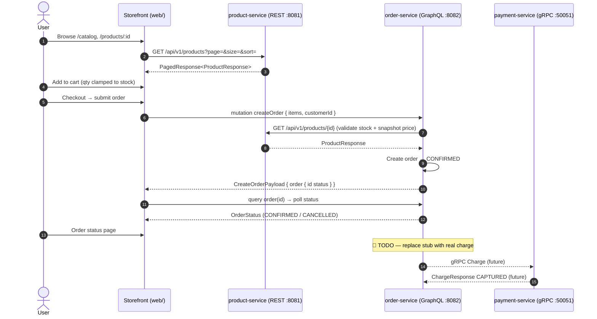
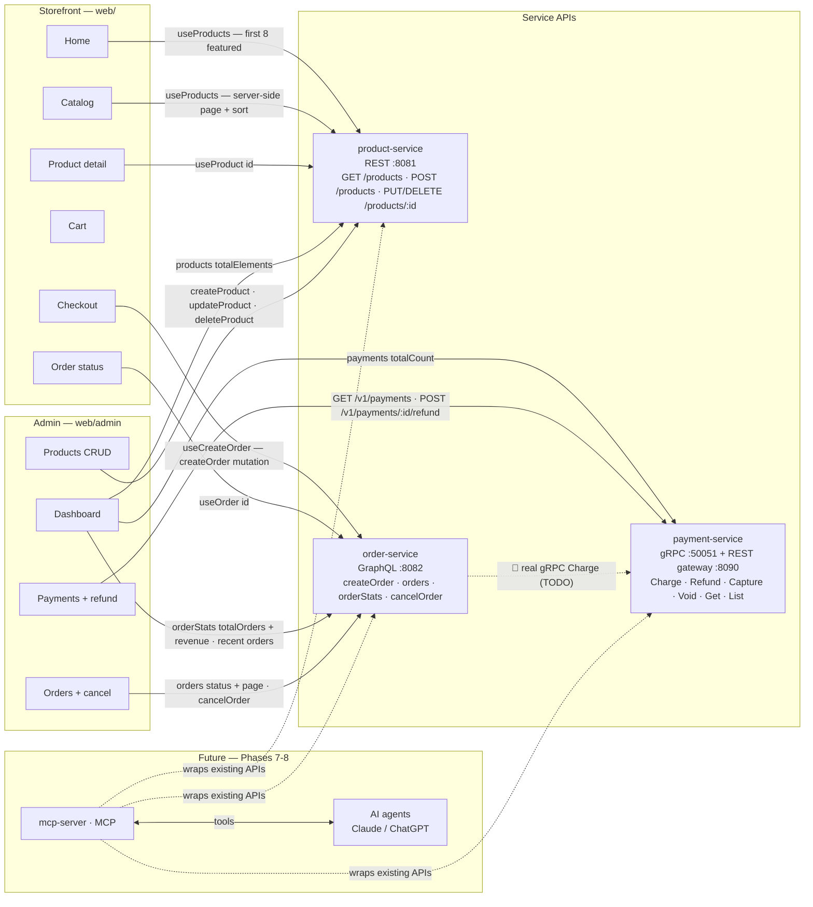

# Commerce Platform

A production-style commerce platform built to learn and demonstrate modern backend
communication protocols — **REST, GraphQL, gRPC, Kafka, and MCP** — by progressively
evolving a real microservices system into an AI-accessible platform.

> **Core idea:** the business domain (Product, Order, Payment) stays constant.
> The protocol used to expose it (REST, GraphQL, gRPC, MCP) is the variable.
> See [`HLD Architect`](./docs/architect.md) for the full reasoning.

This README is written so a beginner can go from "what is this?" to "I'm running it and I understand the pieces" — in order. [Jump to the learning path](#docs--learning-path).

---

## Table of Contents

1. [Quick Start (5 minutes)](#quick-start-5-minutes)
2. [What this is](#what-this-is)
3. [Architecture at a Glance](#architecture-at-a-glance)
4. [How the pieces talk](#how-the-pieces-talk)
5. [Repository Layout](#repository-layout)
6. [Running the Project](#running-the-project)
7. [Deployment & Containers](#deployment--containers)
8. [Docs & Learning Path](#docs--learning-path)
9. [Roadmap / Phases](#roadmap--phases)
10. [Todos](#todos)
11. [Session History](#session-history)
12. [Learning Outcomes](#learning-outcomes)

---

## Quick Start (5 minutes)

**What you'll run and why** — one command starts PostgreSQL plus four services, each as
a separate process (host mode) or its own container (docker mode). Every service
auto-creates **and migrates** its own database on first boot (`productdb`, `orderdb`,
`paymentdb`), and product-service seeds sample products.

**Prerequisites:** Docker (OrbStack/Docker Desktop), Java 21, Maven, Go 1.2x, Node 20+.

```bash
./scripts/run-demo.sh          # host processes — one log file per service in ./logs/
./scripts/run-demo.sh docker   # one container per service — docker compose logs -f <svc>
```

When it finishes, open:

| URL | What you'll see |
|---|---|
| **http://localhost:5173** | ApnaKart storefront — browse ₹ catalog, cart, checkout, order **CONFIRMED** |
| **http://localhost:5173/admin** | Admin dashboard — KPIs, Products CRUD, Orders view/cancel, Payments view/refund (no auth yet) |

A full smoke check runs at the end (all ports up + a sample order). Beginners:
**try the storefront once before reading on** — the rest of the docs make a lot more
sense after you've clicked through catalog → cart → checkout → order confirmed.

---

## What this is

Three business microservices, each intentionally built with a **different protocol**,
integrated via Kafka events (planned), fully observable, and finally exposed to AI
agents through an MCP server — **without rewriting any existing service**.

| Service | Language | Protocol | Responsibility |
|---|---|---|---|
| `product-service` | Java 21 + Spring Boot | REST | Product catalog, search, inventory |
| `order-service` | Java 21 + Spring GraphQL | GraphQL | Order lifecycle, customer orders |
| `payment-service` | Go | gRPC | Charge, refund, capture, payment status |
| `mcp-server` | Python | MCP | Exposes the above as AI tools (adapter only, no business logic) — Phase 7 |
| `web/` (storefront + admin) | React + Vite + TypeScript | REST / GraphQL / gRPC-via-gateway | The human front-end of the whole platform |

> **Why different protocols?** Each service uses the protocol that best fits its job.
> Compare them as you read each service's README — that comparison *is* the learning goal.

### Tech Stack

| Layer | Technology | Status |
|---|---|---|
| REST | Java 21 + Spring Boot | ✅ live |
| GraphQL | Java 21 + Spring GraphQL | ✅ live |
| gRPC | Go | ✅ live |
| REST gateway (gRPC → HTTP) | grpc-gateway | ✅ live on `:8090` |
| MCP | Python | ⬜ Phase 7 |
| Database | PostgreSQL (one per service, auto-migrated) | ✅ live |
| Cache | Redis | ⬜ Phase 5+ |
| Messaging | Kafka | ⬜ Phase 5 |
| API Gateway / Auth | Kong + Keycloak | ⬜ Phase 8 |
| Observability | Prometheus / Grafana / Jaeger / Loki | ⬜ Phase 6 |

*"⬜" rows are part of the target architecture; only "✅" rows run today.*

---

## Architecture at a Glance

```
Web Client (Storefront + Admin dashboard, web/)
   |
 REST / GraphQL (via Vite dev proxy; Kong gateway planned)
   |
Product Service (REST) ─┐
Order Service (GraphQL) ─┼─> Kafka Events (planned) ─> Consumers
Payment Service (gRPC)  ─┘        |
                            Jaeger / Prometheus / Loki (planned)
```

AI agents reach the same platform through a Python MCP server that wraps the
existing REST/GraphQL/gRPC APIs as tools — **no duplicated business logic**:

```
Claude / ChatGPT ──MCP──> mcp-server ──> Product REST / Order GraphQL / Payment gRPC
```

Full diagrams, the communication matrix, and an end-to-end request walkthrough live in
[`docs/architect.md`](./docs/architect.md).

---

## How the pieces talk

### End-to-End Flow (storefront, today)

UI → REST catalog → GraphQL checkout → (stub) payment. The bold gap below is the
next 🔴 todo.



### UI ↔ API Integration Map

Which page calls which API today (storefront + admin), and where the AI/MCP layer
plugs in later:



Notes:

- **Search `q` on Catalog** is client-side today — it filters the page already loaded
  from `useProducts`; pagination and sort run on product-service. (Server-side
  full-text search is a 🟡 todo.)
- **Cart** is local-only, persisted to `localStorage` via Zustand — no API call.
- **Dashboard KPIs** come from three live calls: `orderStats` (orders + revenue),
  `products.totalElements`, and `payments.totalCount`.
- **Refunds & admin payments** go through the payment-service REST gateway (`:8090`,
  same gRPC backend); Order-cancel hits order-service GraphQL.
- **`order-service → payment-service`** still uses `StubPaymentClient` — the real gRPC
  `Charge` is the 🔴 todo above.

---

## Repository Layout

```
commerce-platform/
├── docs/                     # ADRs, architecture, per-topic guides (learning path below)
├── common/                   # Shared proto contracts, event schemas, libs  (placeholder)
├── product-service/          # Java + Spring Boot (REST)
├── order-service/            # Java + Spring GraphQL
├── payment-service/          # Go (gRPC)
├── mcp-server/               # Python (MCP)  (placeholder — Phase 7)
├── web/                      # ApnaKart storefront + admin (React + Vite)
├── docker/                   # docker-compose files (infra + one container per service)
├── scripts/                  # run-demo.sh, seed-data, migrations
└── infrastructure/           # k8s manifests, monitoring configs  (placeholder)
```

Full per-service folder layouts are in [`docs/plan.md`](./docs/plan.md).

---

## Running the Project

### Option A — one command (recommended)

```bash
./scripts/run-demo.sh          # host processes — logs/ per service
./scripts/run-demo.sh docker   # every service as its own container — docker compose logs
```

The script checks prerequisites, starts Postgres (compose), then starts the three
services + the storefront (if a port is already in use it reuses it). Host mode
writes full logs to `./logs/*.log`; **docker mode** runs one container per service
(see [Deployment & Containers](#deployment--containers)) so each has its own log
stream — `docker compose -f docker/docker-compose.yml logs -f product-service`.
When it finishes, open **http://localhost:5173** (either mode).

### Option B — step by step (to understand the moving parts)

**Step 1 — infrastructure.** Postgres is enough for the demo; the rest (Redis,
Kafka, Keycloak, Kong) is for later phases:

```bash
docker compose -f docker/docker-compose.yml up -d postgres
# optional — full infra: docker compose -f docker/docker-compose.yml up -d
```

**Step 2 — the three services** (one terminal each):

| Service | Command | Ports |
|---|---|---|
| product-service | `cd product-service && ./mvnw spring-boot:run` | REST `8081` |
| order-service | `cd order-service && mvn spring-boot:run -q` | GraphQL `8082` (GraphiQL on `/graphiql`) |
| payment-service | `cd payment-service && go run ./cmd/server` | gRPC `50051`, REST+Swagger `8090` |

> order-service has **no Maven wrapper** — use system `mvn`.

**Step 3 — the storefront**:

```bash
cd web
npm install      # first time only
npm run dev      # http://localhost:5173
```

Vite dev-proxies `/api` → `:8081`, `/graphql` → `:8082` and `/v1` → `:8090`
(Kong replaces this in production). Click through: browse → add to cart → checkout →
order **CONFIRMED**. The **admin dashboard** lives at **http://localhost:5173/admin**
(no auth yet — Keycloak comes later): Dashboard KPIs, Products CRUD, Orders
view/filter/cancel, Payments view/filter/refund.

**Step 4 — verify every layer** (run with the stack up):

```bash
# Product REST
curl "http://localhost:8081/api/v1/products?page=0&size=5"

# Order GraphQL — createOrder returns an Order! directly; customerId is a UUID
curl -X POST http://localhost:8082/graphql -H 'Content-Type: application/json' -d '{
  "query": "mutation($id:ID!,$qty:Int!){createOrder(input:{customerId:\"11111111-1111-1111-1111-111111111111\",currency:\"INR\",items:[{productId:$id,quantity:$qty}]}){id status totalAmount currency}}",
  "variables": { "id": "11111111-1111-1111-1111-111111111112", "qty": 1 }
}'

# Order GraphQL — list all orders + store stats (drives the admin dashboard)
curl -s -X POST http://localhost:8082/graphql -H 'Content-Type: application/json' -d '{
  "query": "{ orderStats { totalOrders revenue } orders(first: 5, status: CONFIRMED) { totalCount orders { id status totalAmount } } }"
}'

# Payment gRPC health + REST charge (customerId must be a UUID)
grpcurl -plaintext localhost:50051 grpc.health.v1.Health/Check
curl -X POST http://localhost:8090/v1/payments -H 'Content-Type: application/json' -d \
  '{"idempotencyKey":"smoke-001","orderId":"11111111-1111-1111-1111-111111111111","customerId":"11111111-1111-1111-1111-111111111111","amountMinor":2999,"currency":"INR","method":"PAYMENT_METHOD_CARD"}'

# Payment REST — list + filter (drives the admin payments page)
curl -s "http://localhost:8090/v1/payments?page=0&page_size=5&status=PAYMENT_STATUS_CAPTURED"
```

**Interactive API tooling per service** (each service is documented by the tool
that fits its protocol):

| Service | Tool | URL |
|---|---|---|
| product-service (REST) | Swagger UI | `http://localhost:8081/swagger-ui.html` (spec at `/api-docs`) |
| order-service (GraphQL) | GraphiQL | `http://localhost:8082/graphiql` |
| payment-service (gRPC + REST gateway) | Swagger UI | `http://localhost:8090/docs` |

> Why no Swagger for order-service? Swagger/OpenAPI documents **REST** endpoints.
> order-service exposes **GraphQL** (single POST `/graphql`), so its tooling is
> GraphiQL instead. If you load `/graphiql`, window `$` toggles the schema docs.

### Testing

```bash
# Frontend E2E (journey + admin smoke + accessibility + visual regression) — needs services up
cd web
npx playwright test                       # run all
npx playwright test --update-snapshots    # re-baseline screenshots after intentional UI changes
npx playwright show-report                # open the HTML report

# Service unit tests (each in its directory)
cd payment-service && go test ./...       # 78% svc coverage
cd product-service && ./mvnw test
cd order-service && mvn test
```

### Troubleshooting & gotchas

- **`GET /graphql` → 405** is normal — GraphQL is POST-only.
- **`customerId` must be a UUID** in order-service and payment-service (Postgres
  `uuid` columns); arbitrary strings fail with `SQLSTATE 22P02`.
- **`createOrder` returns `Order!` directly** — there is no `{ order { ... } }` wrapper.
- **🔥 Order payment is still a stub** (always succeeds, no real Charge yet) — the
  gRPC `Charge` integration is the top 🔴 todo. Until then `payment-service` is
  exercised independently (curl/grcpcurl/Swagger above).
- Host mode: services bind `localhost` only; if a port is taken the script reuses
  the running process rather than starting a duplicate.
- Docker mode: stop apps with `./scripts/run-demo.sh docker stop` (or `docker stop
  --keep-db` to keep Postgres + data); watch one container with `docker compose -f
  docker/docker-compose.yml logs -f <service>`. First docker run builds images
  (a few minutes).

---

## Deployment & Containers

Each service is containerized independently (own `Dockerfile`, healthcheck, log
stream) — see [**Infra Setup & Deployment Strategy**](./docs/infrastructure.md#infra-setup--deployment-strategy)
in `docs/infrastructure.md` for the units of deployment, the CI/CD strategy, and the
exact build/start/stop/restart/log commands per service. Config is injected via
environment variables (`DB_URL`, `PRODUCT_SERVICE_URL`, `WEB_PROXY_*`) — nothing is
baked into an image.

---

## Docs & Learning Path

All learning docs are organized as a **numbered path** below. A beginner who reads
them in order gets the full story with zero gaps: plan → architecture → each protocol
where it lives → frontend → testing → deployment. Each step says what you'll learn
and what it assumes.

### If you're new — read in this order

| # | Document | What you'll learn | Assumes |
|---|---|---|---|
| 1 | [**Project Plan**](./docs/plan.md) | The "what/why", full folder layouts, phase-by-phase execution, protocol best-practices, milestone checklist | nothing |
| 2 | [**Architecture (HLD)**](./docs/architect.md) | 10,000-foot view: guiding principle, gateway/auth design, communication matrix, observability, staff-level patterns checklist | nothing |
| 3 | [**Product Service README**](./product-service/README.md) | First protocol — **REST**: layered architecture, DTO/entity separation, RFC 7807 error shape, how to run & test | #1, #2 (start simple) |
| 4 | [**GraphQL concepts (beginner guide)**](./docs/graphql-concepts.md) | The mental model before reading order-service: REST vs GraphQL, resolvers, custom scalars, N+1/DataLoader, error shape | #3 (REST baseline helps the comparison) |
| 5 | [**Order Service README**](./order-service/README.md) | Second protocol — **GraphQL** in practice: schema-first, resolvers, DataLoader fix, internal flows, error contracts | #4 |
| 6 | [**Payment Service README**](./payment-service/README.md) | Third protocol — **gRPC**: RPCs, idempotent money movement, state machine, error mapping, REST gateway | #3 (compares well against REST) |
| 7 | [**Frontend Architecture**](./docs/frontend-architecture.md) | How `web/` is built: stack, folder layout, pages, verified API contracts, state & error handling | #3–#6 (the APIs it consumes) |
| 8 | [**Testing Strategy**](./docs/testing-strategy.md) | E2E + accessibility + visual-regression approach, what's automated vs manual, how to run | #7 |
| 9 | [**Infrastructure & Deployment**](./docs/infrastructure.md) | Containers, docker-compose, per-service healthchecks, CI/CD + deployment strategy, deploy commands | #1–#8 |
| 10 | (reference) [**ADR-001: Foundation Decisions**](./docs/adr-001-foundation-decisions.md) | Why monorepo / Kong / Keycloak / Maven — recorded decisions and their consequences | any time |

Also part of the path: [`web/README.md`](./web/README.md) (quick run + layout of the
storefront/admin app).

### Reference map — "I want to know…"

| I want to… | Go to… |
|---|---|
| run the demo right now | [Quick Start](#quick-start-5-minutes) or [`infrastructure.md`](./docs/infrastructure.md#starting-and-stopping) |
| understand one protocol (REST / GraphQL / gRPC) | the matching service README (+ [`GraphQL concepts`](./docs/graphql-concepts.md) for GraphQL) |
| see how the whole system fits together | [`architect.md`](./docs/architect.md) |
| change or add a storefront page | [`frontend-architecture.md`](./docs/frontend-architecture.md) |
| write / regenerate E2E tests | [`testing-strategy.md`](./docs/testing-strategy.md) |
| deploy or manage containers | [`infrastructure.md`](./docs/infrastructure.md) |
| know why a foundational choice was made | [`adr-001`](./docs/adr-001-foundation-decisions.md) |
| know what's next | [Roadmap](#roadmap--phases) + [Todos](#todos) |
| see the project's history | [Session History](#session-history) |

---

## Roadmap / Phases

| Phase | Focus | Status |
|---|---|---|
| 0 | Planning | ✅ |
| 1 | Foundation (repo, docker-compose, empty service skeletons) | ✅ |
| 2 | Product Service (REST) | ✅ Core (CRUD, OpenAPI, error handling) |
| 3 | Order Service (GraphQL) | ✅ Core (create/cancel/query, DataLoader, scalars, GraphiQL; tests + payment gRPC pending) |
| 4 | Payment Service (gRPC) | ✅ |
| 5 | Event-Driven Architecture (Kafka) | ⬜ |
| 6 | Observability | ⬜ |
| 7 | MCP Server | ⬜ |
| 8 | AI Layer (Anthropic/OpenAI SDK, LangGraph) | ⬜ |
| 9 | Production Readiness (CI/CD, testing, security) | ⬜ |

See [`docs/plan.md`](./docs/plan.md) for the full phase-by-phase checklist and
protocol-specific best practices.

---

## Todos

> Legend: 🔴 **Must** complete (gates the working demo) · 🟡 **Should** (production-style) · 🔵 **Nice-to-have**

| Area | Task | Priority | Status |
|---|---|---|---|
| **Frontend** | Build React + Vite storefront (`web/`) — catalog, cart, checkout, order status | 🔴 | ✅ |
| **Frontend** | Admin dashboard (`/admin`) — Dashboard KPIs, Products CRUD, Orders view/cancel, Payments view/refund | 🔵 | ✅ |
| **Backend** | Admin APIs — `orders(first,offset,status)` + `orderStats` (GraphQL), `ListPayments` REST (payment) | 🔴 | ✅ |
| **Backend** | Replace order-service `StubPaymentClient` with a real gRPC `Charge` → payment-service `:50051` | 🔴 | ⬜ |
| **Backend** | Testcontainers unit/integration tests for product + order services (≥80% coverage) | 🔴 | ⬜ |
| **Edge** | Kong API Gateway — routes for product/order (+ payment REST), JWT plugin, rate limiting | 🟡 | ⬜ |
| **Edge** | Keycloak — realm, web client (PKCE), MCP client-credentials, JWKS wired to Kong | 🟡 | ⬜ |
| **Frontend** | Real search — product-service full-text search endpoint (search is client-side filtered today) | 🟡 | ⬜ |
| **Frontend** | Keycloak sign-in (PKCE) replacing the mock identity | 🟡 | ⬜ |
| **Frontend** | CI step to regenerate/verify Playwright visual baselines per platform | 🟡 | ⬜ |
| **Events** | Kafka events (Phase 5) — OrderCreated/Cancelled, PaymentSucceeded/Failed, + DLQ | 🟡 | ⬜ |
| **Observability** | Phase 6 — Jaeger tracing, Prometheus/Grafana, structured logs with correlation ID | 🟡 | ⬜ |
| **AI** | MCP server tools over existing APIs (Phase 7) + AI layer (Phase 8) | 🟡 | ⬜ |
| **CI** | CI/CD, load tests, security pass (Phase 9) | 🟡 | ⬜ |
| **Perf** | Redis read-through cache for product-service | 🔵 | ⬜ |

---

## Session History

| Session | Link | What was built |
|---|---|---|
| product-service-and-skills-setup | [OpenCode Session](https://opncd.ai/share/g9HqARE1) | Phase 0-2: Planning, infra (Docker Compose), Product Service REST (CRUD, validation, OpenAPI, error handling), opencode plugins + skills |
| order-service-and-graphql-bootcamp | `ses_f8cbc723bffeLgUhrQDsDK3Qwf` | Phase 3: Order Service GraphQL — schema + custom `BigDecimal`/`DateTime` scalars, Query/Mutation resolvers, DataLoader (N+1 fix), typed errors (`extensions.code`), GraphiQL, product-service REST integration, README + [GraphQL concepts guide](./docs/graphql-concepts.md) |
| payment-service-grpc-phase-4 | `ses_f81efd3deffepnpkdekguF5zqX` | Phase 4: Payment Service gRPC — 5 RPCs (Charge/Refund/Capture/Void/GetPayment), idempotent money movement (`int64` minor units), state machine, interceptors, health/reflection, grpc-gateway REST + Swagger UI, unit tests (78% svc coverage), layering guide + beginner README |
| web-frontend-phase-5 | `feat/web-frontend` | Frontend: React + Vite storefront `web/` — REST + GraphQL clients, catalog/cart/checkout/order-status pages, Playwright E2E journey + ARIA structure + visual-regression baselines, `docs/frontend-architecture.md` + `docs/testing-strategy.md` |
| web-frontend-apnakart-admin | `ses_f81efd3deffepnpkdekguF5zqX` (continued) · `feat/web-frontend` | Phase 5-6: ApnaKart rebrand (INR / ₹, real product images, demo copy removed) · admin dashboard `/admin` (KPIs, products CRUD, orders view/cancel, payments view/refund via Vite `/v1` proxy) · backend admin APIs (product `imageUrl` + 12 ₹ seeds V3/V4, order `orders`+`orderStats` GraphQL, payment `ListPayments` REST gateway) · unit tests (order Mockito, payment Go) · E2E rebrand + `admin.spec.ts` + regenerated visual baselines · storefront `createOrder` forced INR · README/docs + `run-demo.sh` (admin link, aligned tooling banner, `stop`/`stop --keep-db`). Open new PR #4 |
| infra-containerization + docs-restructure | `ses_f81efd3deffepnpkdekguF5zqX` (continued) · `feat/docker-containers` | Each service containerized (own Dockerfile, healthcheck, log stream) + `docker-compose` app services + `run-demo.sh docker` mode + `docs/infrastructure.md` deployment strategy + this README restructure (PR #5) |

---

## Learning Outcomes

By completing this project you will have hands-on experience with REST, GraphQL,
gRPC, Kafka, Docker, PostgreSQL, Redis, Python MCP, AI agents, distributed systems
design, and observability tooling.