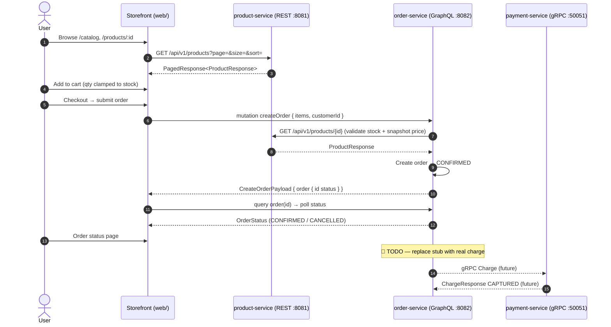
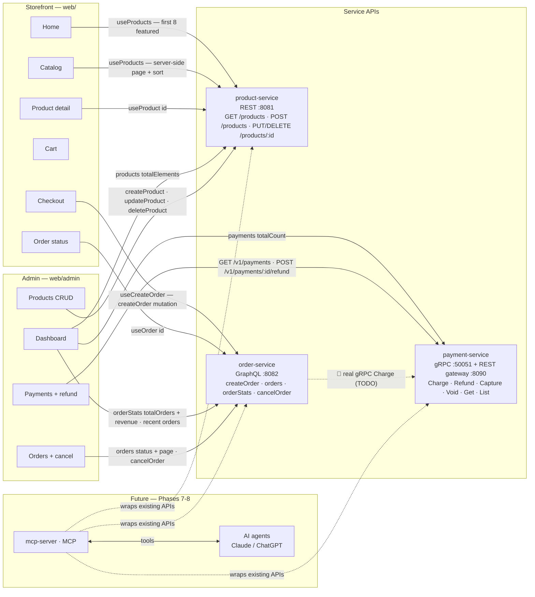

# Commerce Platform

A production-style commerce platform built to learn and demonstrate modern backend
communication protocols — REST, GraphQL, gRPC, Kafka, and MCP — by progressively
evolving a real microservices system into an AI-accessible platform.

> **Core idea:** the business domain (Product, Order, Payment) stays constant.
> The protocol used to expose it (REST, GraphQL, gRPC, MCP) is the variable.
> See [`HLD Architect`](./docs/architect.md) for the full reasoning.

---

## What this is

Three business microservices, each intentionally built with a different protocol,
integrated via Kafka events, fully observable, and finally exposed to AI agents
through an MCP server — without rewriting any of the existing services.

| Service | Language | Protocol | Responsibility |
|---|---|---|---|
| `product-service` | Java 21 + Spring Boot | REST | Product catalog, search, inventory |
| `order-service` | Java 21 + Spring GraphQL | GraphQL | Order lifecycle, customer orders |
| `payment-service` | Go | gRPC | Charge, refund, capture, payment status |
| `mcp-server` | Python | MCP | Exposes the above as AI tools (adapter only, no business logic) |

---

## Tech Stack

| Layer | Technology |
|---|---|
| REST | Java 21 + Spring Boot |
| GraphQL | Java 21 + Spring GraphQL |
| gRPC | Go |
| MCP | Python |
| Database | PostgreSQL (one per service) |
| Cache | Redis |
| Messaging | Kafka |
| API Docs | OpenAPI |
| Containers | Docker / Docker Compose |
| Monitoring | Prometheus + Grafana |
| Logging | ELK / Loki |
| Tracing | OpenTelemetry + Jaeger |

---

## Repository Structure

```
commerce-platform/
├── docs/                     # ADRs, API docs, diagrams, runbooks
├── common/                   # Shared proto contracts, event schemas, libs
├── product-service/          # Java + Spring Boot (REST)
├── order-service/            # Java + Spring GraphQL
├── payment-service/          # Go (gRPC)
├── mcp-server/                # Python (MCP)
├── docker/                    # docker-compose files
├── scripts/                   # setup, seed-data, migration scripts
└── infrastructure/             # k8s manifests, monitoring configs
```

Full per-service folder layouts are in [`plan doc`](./docs/plan.md).

---

## Architecture at a Glance

```
Web Client (Storefront + Admin dashboard, web/)
   |
REST / GraphQL
   |
Product Service (REST) ─┐
Order Service (GraphQL) ─┼─> Kafka Events ─> Consumers
Payment Service (gRPC)  ─┘        |
                           Jaeger / Prometheus / Loki
```

AI agents reach the same platform through a Python MCP server that wraps the
existing REST/GraphQL/gRPC APIs as tools — no duplicated business logic:

```
Claude / ChatGPT ──MCP──> mcp-server ──> Product REST / Order GraphQL / Payment gRPC
```

Full diagrams, communication matrix, and an end-to-end request walkthrough are in
[`HLD Architect`](./docs/architect.md).

---

## End-to-End Flow (Storefront)

UI → REST catalog → GraphQL checkout → (stub) payment. The bold gaps below are the
next 🔴 todos.



## UI ↔ API Integration Map

Which page calls which API today (storefront + admin), and where the AI/MCP layer plugs in later:



Notes:

- **Search `q` on Catalog** is client-side — it filters the page already loaded from `useProducts`; pagination and sort run on product-service.
- **Cart** is local-only, persisted to `localStorage` via Zustand — no API call.
- **Dashboard KPIs** come from three live calls: `orderStats` (orders + revenue), `products.totalElements`, and `payments.totalCount`.
- **Refunds & admin payments** go through the payment-service REST gateway (`:8090`, same gRPC backend); Order-cancel hits order-service GraphQL.
- **`order-service → payment-service`** still uses `StubPaymentClient` — the real gRPC `Charge` is the 🔴 TODO above.

---

## Getting Started

**What you'll run and why** — Docker provides just the infrastructure (Postgres);
the three services and the storefront run on your machine so you can watch them
separately. Every service auto-creates + migrates its own database on first boot
(`productdb`, `orderdb`, `paymentdb`) and product-service seeds sample products.

### Option A — one command (recommended)

```bash
./scripts/run-demo.sh
```

The script checks prerequisites, starts Postgres (compose), then starts the three
services + the storefront (if a port is already in use it reuses it). Full logs in
`./logs/*.log`. When it finishes, open **http://localhost:5173**.

Prerequisites: Docker, Java 21, Maven, Go 1.2x, Node 20+.

### Option B — step by step (to understand the moving parts)

**Step 1 — infrastructure.** Postgres is enough for the demo; the rest (Redis,
Kafka, Keycloak, Kong) is for later phases:

```bash
docker compose -f docker/docker-compose.yml up -d postgres
# optional — full infra: docker compose -f docker/docker-compose.yml up -d
```

**Step 2 — the three services** (one terminal each):

| Service | Command | Ports |
|---|---|---|
| product-service | `cd product-service && ./mvnw spring-boot:run` | REST `8081` |
| order-service | `cd order-service && mvn spring-boot:run -q` | GraphQL `8082` (GraphiQL on `/graphiql`) |
| payment-service | `cd payment-service && go run ./cmd/server` | gRPC `50051`, REST+Swagger `8090` |

> order-service has **no Maven wrapper** — use system `mvn`.

**Step 3 — the storefront**:

```bash
cd web
npm install      # first time only
npm run dev      # http://localhost:5173
```

Vite dev-proxies `/api` → `:8081`, `/graphql` → `:8082` and `/v1` → `:8090`
(Kong replaces this in production). Click through: browse → add to cart → checkout →
order **CONFIRMED**. The **admin dashboard** lives at **http://localhost:5173/admin**
(no auth yet — Keycloak comes later): Dashboard KPIs, Products CRUD, Orders
view/filter/cancel, Payments view/filter/refund.

**Step 4 — verify every layer** (run with the stack up):

```bash
# Product REST
curl "http://localhost:8081/api/v1/products?page=0&size=5"

# Order GraphQL — createOrder returns an Order! directly; customerId is a UUID
curl -X POST http://localhost:8082/graphql -H 'Content-Type: application/json' -d '{
  "query": "mutation($id:ID!,$qty:Int!){createOrder(input:{customerId:\"11111111-1111-1111-1111-111111111111\",currency:\"INR\",items:[{productId:$id,quantity:$qty}]}){id status totalAmount currency}}",
  "variables": { "id": "11111111-1111-1111-1111-111111111112", "qty": 1 }
}'

# Order GraphQL — list all orders + store stats (drives the admin dashboard)
curl -s -X POST http://localhost:8082/graphql -H 'Content-Type: application/json' -d '{
  "query": "{ orderStats { totalOrders revenue } orders(first: 5, status: CONFIRMED) { totalCount orders { id status totalAmount } } }"
}'

# Payment gRPC health + REST charge (customerId must be a UUID)
grpcurl -plaintext localhost:50051 grpc.health.v1.Health/Check
curl -X POST http://localhost:8090/v1/payments -H 'Content-Type: application/json' -d \
  '{"idempotencyKey":"smoke-001","orderId":"11111111-1111-1111-1111-111111111111","customerId":"11111111-1111-1111-1111-111111111111","amountMinor":2999,"currency":"INR","method":"PAYMENT_METHOD_CARD"}'

# Payment REST — list + filter (drives the admin payments page)
curl -s "http://localhost:8090/v1/payments?page=0&page_size=5&status=PAYMENT_STATUS_CAPTURED"
```

**Interactive API tooling per service** (each service is documented by the tool
that fits its protocol):

| Service | Tool | URL |
|---|---|---|
| product-service (REST) | Swagger UI | `http://localhost:8081/swagger-ui.html` (spec at `/api-docs`) |
| order-service (GraphQL) | GraphiQL | `http://localhost:8082/graphiql` |
| payment-service (gRPC + REST gateway) | Swagger UI | `http://localhost:8090/docs` |

> Why no Swagger for order-service? Swagger/OpenAPI documents **REST** endpoints.
> order-service exposes **GraphQL** (single POST `/graphql`), so its tooling is
> GraphiQL instead. If you load `/graphiql`, window `$` toggles the schema docs.

### Testing

```bash
# Frontend E2E (journey + accessibility + visual regression) — needs services up
cd web
npx playwright test                       # run all
npx playwright test --update-snapshots    # re-baseline screenshots after intentional UI changes
npx playwright show-report                # open the HTML report

# Service unit tests (each in its directory)
cd payment-service && go test ./...       # 78% svc coverage
cd product-service && ./mvnw test
cd order-service && mvn test
```

### Troubleshooting & gotchas

- **`GET /graphql` → 405** is normal — GraphQL is POST-only.
- **`customerId` must be a UUID** in order-service and payment-service (Postgres
  `uuid` columns); arbitrary strings fail with `SQLSTATE 22P02`.
- **`createOrder` returns `Order!` directly** — there is no `{ order { ... } }` wrapper.
- **🔥 Order payment is still a stub** (always succeeds, no real Charge yet) — the
  gRPC `Charge` integration is the top 🔴 todo. Until then `payment-service` is
  exercised independently (curl/grcpcurl/Swagger above).
- Services bind `localhost` only; if a port is taken the script reuses the running
  process rather than starting a duplicate.

Per-service READMEs: [product-service](./product-service/README.md) ·
[order-service](./order-service/README.md) · [payment-service](./payment-service/README.md).

---

## Roadmap / Phases

| Phase | Focus | Status |
|---|---|---|
| 0 | Planning | ✅ |
| 1 | Foundation (repo, docker-compose, empty service skeletons) | ✅ |
| 2 | Product Service (REST) | ✅ Core (CRUD, OpenAPI, error handling) |
| 3 | Order Service (GraphQL) | ✅ Core (create/cancel/query, DataLoader, scalars, GraphiQL; tests + payment gRPC pending) |
| 4 | Payment Service (gRPC) | ✅ |
| 5 | Event-Driven Architecture (Kafka) | ⬜ |
| 6 | Observability | ⬜ |
| 7 | MCP Server | ⬜ |
| 8 | AI Layer (Anthropic/OpenAI SDK, LangGraph) | ⬜ |
| 9 | Production Readiness (CI/CD, testing, security) | ⬜ |

See [`plan.md`](./plan.md) for the full phase-by-phase checklist and
protocol-specific best practices.

---

## Todos

> Legend: 🔴 **Must** complete (gates the working demo) · 🟡 **Should** (production-style) · 🔵 **Nice-to-have**

| Area | Task | Priority | Status |
|---|---|---|---|
| **Frontend** | Build React + Vite storefront (`web/`) — catalog, cart, checkout, order status | 🔴 | ✅ |
| **Frontend** | Admin dashboard (`/admin`) — Dashboard KPIs, Products CRUD, Orders view/cancel, Payments view/refund | 🔵 | ✅ |
| **Backend** | Admin APIs — `orders(first,offset,status)` + `orderStats` (GraphQL), `ListPayments` REST (payment) | 🔴 | ✅ |
| **Backend** | Replace order-service `StubPaymentClient` with a real gRPC `Charge` → payment-service `:50051` | 🔴 | ⬜ |
| **Backend** | Testcontainers unit/integration tests for product + order services (≥80% coverage) | 🔴 | ⬜ |
| **Edge** | Kong API Gateway — routes for product/order (+ payment REST), JWT plugin, rate limiting | 🟡 | ⬜ |
| **Edge** | Keycloak — realm, web client (PKCE), MCP client-credentials, JWKS wired to Kong | 🟡 | ⬜ |
| **Frontend** | Real search — product-service full-text search endpoint (search is client-side filtered today) | 🟡 | ⬜ |
| **Frontend** | Keycloak sign-in (PKCE) replacing the mock identity | 🟡 | ⬜ |
| **Frontend** | CI step to regenerate/verify Playwright visual baselines per platform | 🟡 | ⬜ |
| **Events** | Kafka events (Phase 5) — OrderCreated/Cancelled, PaymentSucceeded/Failed, + DLQ | 🟡 | ⬜ |
| **Observability** | Phase 6 — Jaeger tracing, Prometheus/Grafana, structured logs with correlation ID | 🟡 | ⬜ |
| **AI** | MCP server tools over existing APIs (Phase 7) + AI layer (Phase 8) | 🟡 | ⬜ |
| **CI** | CI/CD, load tests, security pass (Phase 9) | 🟡 | ⬜ |
| **Perf** | Redis read-through cache for product-service | 🔵 | ⬜ |

---

## Session History

| Session | Link | What was built |
|---|---|---|
| product-service-and-skills-setup | [OpenCode Session](https://opncd.ai/share/g9HqARE1) | Phase 0-2: Planning, infra (Docker Compose), Product Service REST (CRUD, validation, OpenAPI, error handling), opencode plugins + skills |
| order-service-and-graphql-bootcamp | `ses_f8cbc723bffeLgUhrQDsDK3Qwf` | Phase 3: Order Service GraphQL — schema + custom `BigDecimal`/`DateTime` scalars, Query/Mutation resolvers, DataLoader (N+1 fix), typed errors (`extensions.code`), GraphiQL, product-service REST integration, README + [GraphQL concepts guide](./docs/graphql-concepts.md) |
| payment-service-grpc-phase-4 | `ses_f81efd3deffepnpkdekguF5zqX` | Phase 4: Payment Service gRPC — 5 RPCs (Charge/Refund/Capture/Void/GetPayment), idempotent money movement (`int64` minor units), state machine, interceptors, health/reflection, grpc-gateway REST + Swagger UI, unit tests (78% svc coverage), layering guide + beginner README |
| web-frontend-phase-5 | `feat/web-frontend` | Frontend: React + Vite storefront `web/` — REST + GraphQL clients, catalog/cart/checkout/order-status pages, Playwright E2E journey + ARIA structure + visual-regression baselines, `docs/frontend-architecture.md` + `docs/testing-strategy.md` |

---

## Documentation

- [`Plan`](./docs/plan.md) — folder structures, phase plan, best practices per protocol
- [`HLD Architect`](./docs/architect.md) — architecture diagrams, design principles, communication matrix, observability & security design
- [`GraphQL concepts (beginner guide)`](./docs/graphql-concepts.md) — REST-vs-GraphQL, resolvers, scalars, DataLoader/N+1, error shape (start here before reading order-service)
- [`product-service/README.md`](./product-service/README.md) — REST service specifics
- [`order-service/README.md`](./order-service/README.md) — GraphQL service specifics + internal flowcharts
- [`Frontend Architecture`](./docs/frontend-architecture.md) — `web/` storefront stack, folder layout, contracts, state/error handling
- [`Testing Strategy`](./docs/testing-strategy.md) — E2E/visual/accessibility approach + what's manual vs automated

---

## Learning Outcomes

By completing this project you will have hands-on experience with REST, GraphQL,
gRPC, Kafka, Docker, PostgreSQL, Redis, Python MCP, AI agents, distributed systems
design, and observability tooling.