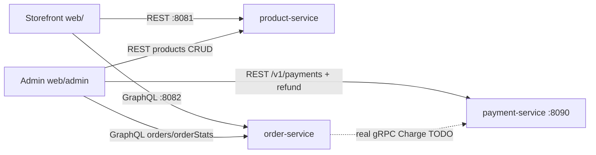

# ApnaKart — Storefront + Admin (`web/`)

Consumer storefront and operator admin dashboard for the commerce platform. A single
React + Vite + TypeScript SPA that exercises the real backend end to end:
**REST (product catalog) → GraphQL (orders) → gRPC (payment, via order-service or
the REST gateway on :8090)**.

## How it fits



The storefront and admin (ways of presenting the domain) and the backend (the
domain) are independent — swap in Kong + Keycloak for auth later without touching
page code, and an MCP server can expose the same APIs to AI agents.

## Run & test

**Fast path — run the whole stack (Postgres + 3 services + this app):**

```bash
./scripts/run-demo.sh     # from the repo root; logs in ./logs/
# then open http://localhost:5173   (storefront)
#         http://localhost:5173/admin (dashboard — no auth yet)
```

**Manual (this app only, services already running):**

```bash
# 1. minimal infra (Postgres only, enough for the storefront)
docker compose -f docker/docker-compose.yml up -d postgres

# 2. services (separate terminals)
cd ../product-service && ./mvnw spring-boot:run        # :8081
cd ../order-service   && mvn spring-boot:run -q        # :8082
cd ../payment-service && go run ./cmd/server           # :50051/:8090

# 3. this app
npm install
npm run dev         # http://localhost:5173

# 4. E2E (journey + accessibility + visual regression)
npx playwright test
npx playwright test --update-snapshots   # re-baseline after intentional UI changes
```

Vite dev-proxies `/api` → `:8081`, `/graphql` → `:8082` and `/v1` → `:8090`.
The full journey with services live: browse → add to cart → checkout → order
**CONFIRMED**. Prices are INR (₹, `en-IN` formatting) and products carry real
images (Unsplash CDN) with a gradient fallback if an image fails to load.
> Note: `createOrder` returns an `Order!` directly (no `{ order }` wrapper) and
> `customerId` must be a UUID.

## Layout

- `src/api/` — typed REST (products, admin payments) + GraphQL (orders) clients with
  React Query hooks; `admin.ts` adds admin-only hooks (orders/orderStats, product
  CRUD, payments + refund)
- `src/store/cart.ts` — persistent Zustand cart
- `src/pages/` — one file per storefront route (`/`, `/catalog`, `/products/:id`,
  `/cart`, `/checkout`, `/orders/:id`)
- `src/admin/` — admin shell + pages (`/admin`, `/admin/products`,
  `/admin/orders`, `/admin/payments`) covering Dashboard KPIs, product CRUD,
  order view/filter/cancel, and payment view/filter/refund
- `e2e/` — Playwright journey + committed visual baselines

## TODOs

- [ ] Server-side full-text search once product-service adds a search endpoint
- [ ] Keycloak (PKCE) sign-in replacing the mock identity (also locks down `/admin`)
- [ ] Real `Charge` in the order-service → payment-service gRPC (fixes simulated payment)
- [ ] CI: regenerate/verify visual baselines per platform
- [ ] Add admin smoke coverage to the E2E suite

See [`docs/frontend-architecture.md`](../docs/frontend-architecture.md) and
[`docs/testing-strategy.md`](../docs/testing-strategy.md) for details.