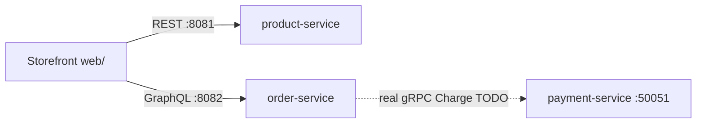

# Lumen & Co. — Storefront (`web/`)

Premium storefront for the commerce platform. React + Vite + TypeScript SPA that
exercises the real backend end to end: **REST (product catalog) → GraphQL (orders)
→ gRPC (payment via order-service, upcoming)**.

## How it fits



The storefront (way of presenting the domain) and the backend (the domain) are
independent — swap in Kong + Keycloak for auth later without touching page code,
and an MCP server can expose the same APIs to AI agents.

## Run & test

```bash
# 1. minimal infra (Postgres only, enough for the storefront)
docker compose -f docker/docker-compose.yml up -d postgres

# 2. services (separate terminals)
cd ../product-service && ./mvnw spring-boot:run        # :8081
cd ../order-service   && mvn spring-boot:run -q        # :8082

# 3. this app
npm install
npm run dev         # http://localhost:5173

# 4. E2E (journey + accessibility + visual regression)
npx playwright test
npx playwright test --update-snapshots   # re-baseline after intentional UI changes
```

Vite dev-proxies `/api` → `:8081` and `/graphql` → `:8082`. The full journey with
services live: browse → add to cart → checkout → order **CONFIRMED**.

## Layout

- `src/api/` — typed REST (products) + GraphQL (orders) clients with React Query hooks
- `src/store/cart.ts` — persistent Zustand cart
- `src/pages/` — one file per route (`/`, `/catalog`, `/products/:id`, `/cart`,
  `/checkout`, `/orders/:id`)
- `e2e/` — Playwright journey + committed visual baselines

## TODOs

- [ ] Server-side full-text search once product-service adds a search endpoint
- [ ] Keycloak (PKCE) sign-in replacing the mock identity
- [ ] Real `Charge` in the order-service → payment-service gRPC (fixes simulated payment)
- [ ] CI: regenerate/verify visual baselines per platform
- [ ] Admin dashboard (product management, order view, refunds)

See [`docs/frontend-architecture.md`](../docs/frontend-architecture.md) and
[`docs/testing-strategy.md`](../docs/testing-strategy.md) for details.